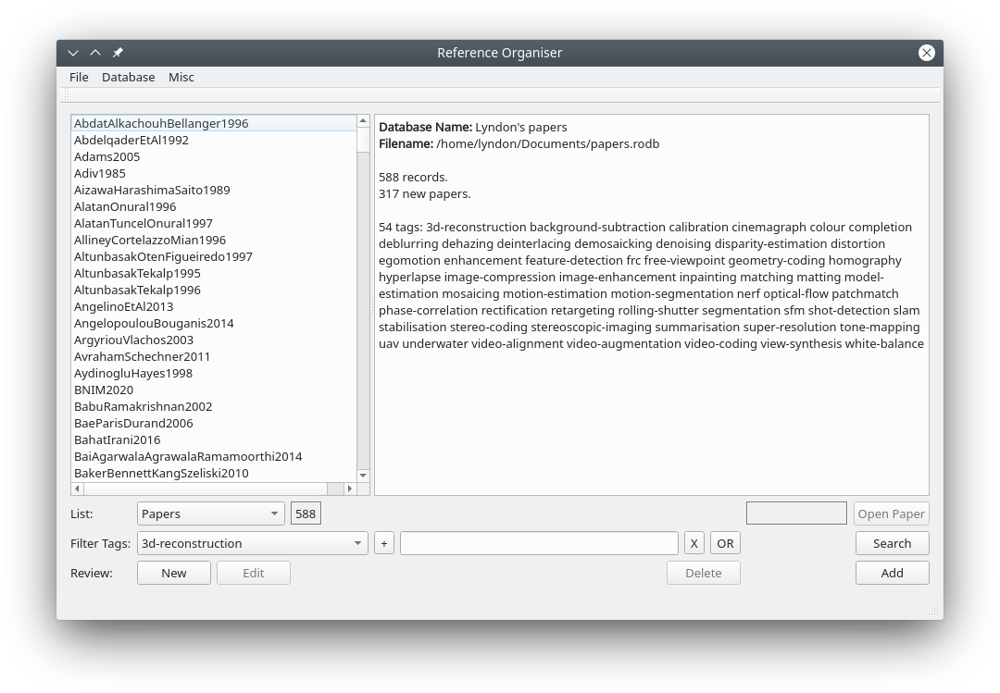

# Reference Organiser

For organising technical papers and your notes/reviews on them.
Reference Organiser has many useful features, such as adding a link to a
review of another paper, capture of full bibliographic details, search,
tags, personal ratings, reviewer ratings, etc.

Source is under [GNU GPL 3](https://www.gnu.org/licenses/gpl.html).

# Dependencies

You will need [Qt](http://qt.io) version 6. Current code is being maintained on
Qt 6.9.

# Building

I am not offering binaries at this time.

* Clone the repo
* Run qmake on the pro file, e.g. `qmake ReferenceOrganiser.pro -o Makefile`
* `make`
* Alternatively load the pro file into QtCreator and build from there

Test Reference Organiser by selecting Database - Load from the menu and
opening the `example.rodb` file.

# Instructions

Full instructions and latest details are available from [lyndonhill.com](https://www.lyndonhill.com/projects/referenceorganiser.html).

Since version 1.3 all paper reviews are stored in a flat file database, you can import
the old style reviews

# Future Work

I use this application all the time so I already have a long list of features to
add, but you can always let me know about an issue on github or via email.

